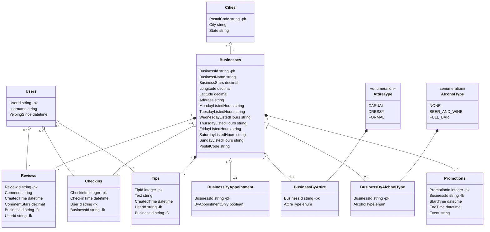

# Welcome to *DineConnect*!

**DineConnect** is a restaurant discovery app that provides convenient restaurant search, personalized recommendations, and location-based suggestions for food enthusiasts who are unhappy with the inconvenience of sifting through various dining options, the lack of personalized restaurant suggestions, and the limitations of current restaurant search methods.

## Features and Capabilities

### Feature 1: Tailor Restaurant Recommendations

When users open our website, our application will offer suggestions for good
restaurants located near their current location. This feature serves as a quick
guide to users, especially when they are not familiar with the area. Whether user are exploring their nearby or having special requests, our suggestions help them to make informed decisions swiftly.

### Feature 2: Interactive Restaurant Engagement

 - Restaurant Reviews

	Users can share their dining experiences by posting detailed restaurant reviews. Whether they want to praise exceptional service or provide constructive 		 feedback, their reviews help fellow diners make informed choices.

 - Check-Ins

	Users can check in at the restaurants they visit, allowing them to share their
real-time dining adventures with friends and followers. Checking in also helps users keep track of their culinary explorations.

 - Restaurant Promotion Events

	For restaurant owners and managers, we provide a platform to create and
promote special events such as happy hours, themed nights, and exclusive menus.
Users can easily discover these events and plan their visits accordingly.

 - User-Generated Tips

	Our community-driven approach allows users to share insider tips and recommendations with other customers. Whether it's a hidden gem on the menu or the best time to visit, these tips enhance the overall dining experience for everyone.

## Data sources
[Kaggle Yelp DataSet](https://www.kaggle.com/datasets/yelp-dataset/yelp-dataset)
> **How to process the data:** To process the data efficiently, start by reading the JSON files using Python and loading them into a Pandas DataFrame. Perform data manipulation, such as filtering and cleaning, and randomly sample 50k records, including associated information. Save the processed data as CSV files for further analysis and application use. This approach optimizes data handling while retaining essential information.

## DineConnect Database UML Design

## Video Demo

    <a href="https://www.loom.com/share/4e917c053d724db8a78fcef6bdee71ff">
      
DineConnect Demo - December 2023 - Watch Video

    </a>
    
  

